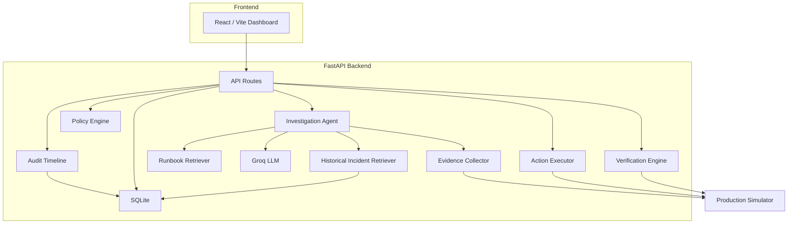

# AI Production Engineer

**AI-assisted incident investigation and response with deterministic safety guardrails.**

An incident response platform that collects production evidence, retrieves operational context, uses an LLM to investigate root cause, and then passes the recommended remediation through a deterministic Policy Engine before any action executes. The LLM recommends. The Policy Engine decides. The Executor performs only registered actions. The Verification Engine determines whether recovery actually occurred.

V1 runs entirely locally using a built-in production simulator — no cloud infrastructure required.

---

## Overview

Production incidents require engineers to correlate metrics, logs, service health, deployment events, historical incidents, and operational runbooks before they can act. This platform automates that correlation and produces a controlled response workflow:

```
Incident detected
  → evidence collected (metrics, logs, events)
  → historical incidents retrieved
  → operational runbooks retrieved
  → LLM investigates root cause
  → remediation recommended
  → Policy Engine evaluates the action
  → low-risk actions execute automatically
  → higher-risk actions wait for human approval
  → bounded action executes against the simulator
  → Verification Engine checks production state
  → incident resolves only when verification passes
```

V1 uses a built-in production simulator so the complete incident lifecycle — from failure injection through verified recovery — can be demonstrated locally without real infrastructure.

---

## Why This Exists

Detection alone is not enough. The difficult part of incident response is everything that happens after an alert fires:

- Understanding what actually failed
- Identifying the likely root cause from available evidence
- Determining the production impact
- Choosing an appropriate remediation that does not make things worse
- Controlling operational risk during remediation
- Verifying that the remediation actually worked
- Preserving an audit trail for post-incident review

This project explores how an LLM can assist with investigation and root-cause analysis while keeping execution behind deterministic controls. The AI is never given autonomous authority — every recommended action passes through a Policy Engine that enforces risk classification, approval requirements, and action registration before anything executes.

---

## Architecture



---

## Safety Architecture

The central safety invariant: **the LLM never directly executes actions**.

```
LLM Investigation
       ↓
  Recommendation
       ↓
  Policy Engine ──→ Block (unknown/dangerous actions)
       ↓
  Approval Gate ──→ Wait (medium/high-risk actions)
       ↓
    Executor ──────→ Fail (unregistered actions)
       ↓
  Verification ───→ Remain unresolved (if checks fail)
       ↓
    Resolved
```

**Safety boundaries enforced by the implementation:**

1. **The LLM is an advisor only.** It produces a root-cause hypothesis and recommends an action. It does not execute anything.
2. **The Policy Engine is deterministic.** It evaluates every recommended action against a static policy table. Unknown actions are blocked by default.
3. **The Executor has a closed action registry.** Only explicitly implemented actions can execute. Any unregistered action returns a failure.
4. **Approval gates are re-checked.** When a human approves an action, the backend independently re-evaluates the policy before executing — preventing stale or tampered approval states from bypassing controls.
5. **Verification is a separate step.** Successful action execution does not resolve the incident. The Verification Engine independently checks production state. If checks fail, the incident remains in `verifying` status.

### Action Policy Table

These are the exact policies implemented in [`engine.py`](app/policy/engine.py):

| Action | Risk Level | Requires Approval | Allowed | Behavior |
|---|---|---|---|---|
| `restart_service` | Low | No | Yes | Executes automatically |
| `increase_connection_pool` | Medium | Yes | Yes | Waits for human approval |
| `rollback_deployment` | Medium | Yes | Yes | Waits for human approval |
| `restart_database` | High | Yes | Yes | Waits for human approval |
| `delete_database` | Critical | Yes | **No** | Blocked — never executes |
| *(any unknown action)* | Critical | Yes | **No** | Blocked by default |

---

## Incident Lifecycle

The system defines the following states:

```
DETECTED → INVESTIGATING → WAITING_APPROVAL → EXECUTING → VERIFYING → RESOLVED
```

| State | Meaning |
|---|---|
| `detected` | Incident created, awaiting investigation |
| `investigating` | AI investigation in progress |
| `waiting_approval` | Policy requires human approval before execution |
| `executing` | Approved or auto-approved action is being executed |
| `verifying` | Action executed, awaiting recovery verification |
| `resolved` | Verification passed, incident closed |

> **Implementation note:** The V1 investigation endpoint processes evidence collection, retrieval, LLM investigation, policy evaluation, and (for low-risk actions) execution within a single synchronous request. The conceptual states `diagnosing` and `recommending` are defined in the `IncidentStatus` enum but are not independently persisted as separate database states during the current synchronous flow.

If the Policy Engine blocks an action or if the AI investigation fails, the incident returns to `detected` rather than becoming stuck in an intermediate state.

---

## Investigation Pipeline

When investigation is triggered on a `detected` incident:

1. **Evidence collection** — Metrics, logs, and events are read from the stored evidence snapshot captured at incident creation.
2. **Historical incident retrieval** — Previously resolved incidents are retrieved from SQLite using token-overlap matching (not embeddings/vector search). Matching is based on service name, title, description, evidence content, and investigation results. Same-service incidents receive a scoring boost.
3. **Runbook retrieval** — Operational runbooks are matched to the current incident using the same token-overlap approach against runbook titles, symptoms, diagnostic steps, and remediation procedures.
4. **LLM investigation** — The Groq LLM receives the current incident metadata, captured production evidence, historical context, and runbook guidance. The prompt explicitly instructs the LLM to treat current evidence as the primary source of truth and historical/runbook data as supporting context only.
5. **Structured output** — The LLM returns a JSON response containing: root cause, supporting evidence, impact assessment, confidence score (0.0–1.0), recommended remediation, and action type.
6. **Policy evaluation** — The recommended action type is evaluated against the Policy Engine.
7. **Routing** — Based on the policy decision, the incident either: executes automatically (low-risk), waits for approval (medium/high-risk), or is blocked (critical/unknown).

---

## Evidence Collection

The V1 evidence collector gathers three signal types from the production simulator:

| Source | Type | Content |
|---|---|---|
| **Metrics** | `dict` | error rate, latency, DB connections (used/max), database health, Redis health, payment gateway health, requests/min |
| **Logs** | `list[str]` | Timestamped application error logs |
| **Events** | `list[str]` | Timestamped system events |

Evidence is captured as a point-in-time snapshot (with `captured_at` timestamp) when the incident is created, and stored as JSON in the incident database record.

---

## Runbooks

Two operational runbooks are implemented:

| ID | Title | Service | Allowed Actions |
|---|---|---|---|
| `RB-001` | Database Connection Pool Exhaustion | `payment-api` | `increase_connection_pool` |
| `RB-002` | Redis Service Failure | `payment-api` | `restart_service` |

Each runbook includes symptoms, diagnostic steps, remediation steps, and verification checks. Runbooks are retrieved using token-overlap matching and provided to the LLM as operational guidance — they do not bypass the Policy Engine or approval system.

---

## Controlled Execution

The Action Executor implements four registered actions that operate against the production simulator:

| Action | What It Does |
|---|---|
| `restart_service` | Restarts the target service (resolves to Redis or the application service based on metrics) |
| `increase_connection_pool` | Increases DB connection pool by 50 (only if utilization ≥ 90%) |
| `rollback_deployment` | Rolls back the current deployment |
| `restart_database` | Restarts the database, resets connections |

The `restart_service` action includes target resolution logic: if Redis is unhealthy in the captured metrics, the restart targets Redis specifically rather than the general application service.

Any unregistered action returns a failure result — the Executor does not attempt to execute unknown actions.

---

## Human Approval

Actions that require approval (medium/high risk) follow this flow:

1. Investigation completes → incident moves to `waiting_approval`
2. Human clicks "Approve" in the dashboard
3. **Backend re-evaluates the Policy Engine** before executing — this prevents approving an action that was changed or tampered with after the original investigation
4. If the re-check passes, the action executes and the incident moves to `verifying`
5. If the re-check fails (e.g., the action was swapped to `delete_database`), the request is rejected with HTTP 403

---

## Recovery Verification

The Verification Engine runs five independent checks against the current production simulator state:

| Check | Threshold | Passes When |
|---|---|---|
| Error rate | ≤ 10% | `error_rate <= 0.10` |
| Latency | ≤ 500 ms | `latency_ms <= 500` |
| DB connection utilization | < 90% | `used / max < 0.90` |
| Database health | Healthy | `database_healthy == true` |
| Redis health | Healthy | `redis_healthy == true` |

**All five checks must pass** for verification to succeed. If any check fails:

- The incident remains in `verifying` status
- A `VERIFICATION_FAILED` event is recorded in the timeline
- The incident is **not** marked as resolved

This prevents false resolution — a successfully executed action that did not actually fix the underlying problem will not close the incident.

---

## Audit Timeline

Every significant workflow event is recorded in the `timeline_events` SQLite table with a timestamp, event type, and descriptive message. Timeline events implemented in the codebase:

| Event Type | When Recorded |
|---|---|
| `INCIDENT_CREATED` | Incident created from simulator |
| `HISTORICAL_CONTEXT_RETRIEVED` | Historical incidents retrieved for investigation |
| `RUNBOOK_CONTEXT_RETRIEVED` | Runbooks retrieved for investigation |
| `INVESTIGATION_COMPLETED` | AI investigation finished |
| `ACTION_BLOCKED` | Policy Engine blocked the recommended action |
| `APPROVAL_REQUIRED` | Human approval required before execution |
| `AUTO_EXECUTION_APPROVED` | Low-risk action approved for automatic execution |
| `APPROVED` | Human approval received and policy re-check passed |
| `RESTART_TARGET_RESOLVED` | Restart target resolved (e.g., to Redis) |
| `ACTION_EXECUTED` | Action executed successfully |
| `ACTION_FAILED` | Action execution failed |
| `VERIFICATION_STARTED` | Recovery verification started |
| `VERIFICATION_COMPLETED` | Recovery verification passed |
| `VERIFICATION_FAILED` | Recovery verification failed |
| `INCIDENT_RESOLVED` | Incident resolved after successful verification |

---

## Production Simulator

The simulator is the local substitute for real production infrastructure in V1. It maintains in-memory state for a `payment-api` service.

### Simulated State

| Metric | Healthy Default | Description |
|---|---|---|
| `error_rate` | 0.01 | Application error rate |
| `latency_ms` | 120 | Request latency in milliseconds |
| `db_connections_used` | 20 | Active database connections |
| `db_connections_max` | 100 | Maximum database connections |
| `database_healthy` | true | Database health flag |
| `redis_healthy` | true | Redis health flag |
| `payment_gateway_healthy` | true | Payment gateway health flag |
| `requests_per_minute` | 100 | Request throughput |

### Failure Scenarios

| Scenario | Endpoint | What It Does |
|---|---|---|
| Database failure | `POST /simulator/failures/database` | Exhausts DB connection pool, raises error rate to 37%, latency to 2500ms |
| Redis failure | `POST /simulator/failures/redis` | Marks Redis unhealthy, raises error rate to 22%, latency to 1200ms |
| Verification failure | `POST /simulator/failures/verification` | Injects degraded metrics (25% error rate, 1800ms latency) to test verification rejection |
| Reset | `POST /simulator/reset` | Returns all metrics to healthy defaults |

Each failure scenario resets to a clean state before injecting the failure, ensuring consistent evidence for each test run.

---

## End-to-End Example: Redis Failure

**Happy path — automatic resolution:**

1. **Trigger:** `POST /simulator/failures/redis` — Redis becomes unhealthy, error rate rises to 22%, latency to 1200ms
2. **Incident created:** e.g. `INC-SIM-XXX` with severity `high`, evidence snapshot captured
3. **Investigate:** `POST /incidents/{id}/investigate`
   - Evidence collected: Redis unhealthy, elevated error rate and latency, Redis error logs
   - Runbook `RB-002` (Redis Service Failure) retrieved as operational context
   - LLM identifies Redis failure as root cause, recommends `restart_service`
4. **Policy evaluation:** `restart_service` is low-risk, no approval required → auto-execution approved
5. **Target resolution:** Metrics show `redis_healthy: false` → restart target resolved to `redis`
6. **Execution:** Redis restarted in simulator, metrics recover (error rate: 1%, latency: 120ms)
7. **Verify:** `POST /incidents/{id}/verify`
   - All five checks pass → incident status becomes `resolved`

**Verification failure path:**

1. After action executes, inject `POST /simulator/failures/verification` before verifying
2. Verification detects error rate 25% (> 10% threshold) and latency 1800ms (> 500ms threshold)
3. Incident remains in `verifying` — no false resolution

---

## Frontend

The React/Vite dashboard provides three main views:

- **Incident List** — All incidents with status, severity, service, confidence score, and delete capability
- **Incident Details** — Investigation results (root cause, evidence, impact, confidence), recommended action, policy decision, approval controls, verification controls, and the complete audit timeline
- **Simulator** — Live simulator metrics and logs, failure injection buttons (database, Redis, verification failure), and simulator reset

The frontend communicates with the backend API at `http://127.0.0.1:8000`. The backend does not serve the frontend — they run as separate processes.

---

## API Reference

### Root & Health

| Method | Endpoint | Description |
|---|---|---|
| `GET` | `/` | Application info and version |
| `GET` | `/health` | Health check |

### Incidents

| Method | Endpoint | Description |
|---|---|---|
| `GET` | `/incidents` | List all incidents |
| `GET` | `/incidents/{id}` | Get incident details |
| `DELETE` | `/incidents/{id}` | Delete incident and its timeline |
| `GET` | `/incidents/{id}/timeline` | Get audit timeline for incident |
| `GET` | `/incidents/{id}/policy` | Evaluate policy for incident's recommended action |
| `POST` | `/incidents/{id}/investigate` | Run AI investigation |
| `POST` | `/incidents/{id}/approve` | Approve and execute (with policy re-check) |
| `POST` | `/incidents/{id}/verify` | Run recovery verification |

### Simulator

| Method | Endpoint | Description |
|---|---|---|
| `GET` | `/simulator/metrics` | Current simulator metrics |
| `GET` | `/simulator/logs` | Current simulator logs |
| `POST` | `/simulator/failures/database` | Inject database connection pool failure |
| `POST` | `/simulator/failures/redis` | Inject Redis failure |
| `POST` | `/simulator/failures/verification` | Inject verification failure (degraded metrics) |
| `POST` | `/simulator/reset` | Reset simulator to healthy defaults |

### Test Utilities

| Method | Endpoint | Description |
|---|---|---|
| `POST` | `/ai/test` | Test Groq LLM connectivity |
| `GET` | `/policy/test/{action}` | Test policy evaluation for any action |
| `POST` | `/simulator/tests/block-dangerous-action/{id}` | Inject `delete_database` action for safety testing |

---

## Tech Stack

| Layer | Technology |
|---|---|
| Backend | Python, FastAPI, Pydantic, SQLAlchemy |
| Database | SQLite (`data/incidents.db`) |
| LLM | Groq API (`qwen/qwen3.8-27b` model) |
| Frontend | React 19, Vite 8, JavaScript |
| Config | pydantic-settings (`.env` file) |

---

## Project Structure

```
ai-production-engineer/
├── app/
│   ├── main.py                  # FastAPI application entry point
│   ├── api/
│   │   ├── health.py            # Health check endpoint
│   │   ├── incidents.py         # Incident CRUD, investigation, approval, verification
│   │   └── simulator.py         # Simulator control endpoints
│   ├── agents/
│   │   └── investigation.py     # LLM investigation agent
│   ├── audit/
│   │   └── timeline.py          # Audit timeline recording and retrieval
│   ├── core/
│   │   └── config.py            # Application settings (Groq API key)
│   ├── database/
│   │   └── database.py          # SQLAlchemy engine, session, Base
│   ├── evidence/
│   │   ├── collector.py         # Evidence snapshot collector
│   │   └── sources.py           # Metrics, logs, events source abstractions
│   ├── executor/
│   │   └── actions.py           # Registered action implementations
│   ├── knowledge/
│   │   ├── retriever.py         # Runbook retrieval (token-overlap matching)
│   │   └── runbooks.py          # Runbook definitions
│   ├── llm/
│   │   ├── base.py              # Abstract LLM interface
│   │   └── groq.py              # Groq API implementation
│   ├── models/
│   │   ├── incident.py          # Pydantic models (Incident, InvestigationResult)
│   │   └── incident_db.py       # SQLAlchemy model (IncidentDB)
│   ├── policy/
│   │   └── engine.py            # Deterministic Policy Engine
│   ├── retrieval/
│   │   └── incident_retriever.py # Historical incident retrieval
│   ├── simulator/
│   │   └── production.py        # In-memory production state simulator
│   └── verification/
│       └── verifier.py          # Recovery verification checks
├── frontend/
│   └── src/
│       ├── App.jsx              # Incident list and main layout
│       ├── IncidentDetails.jsx  # Investigation, approval, verification UI
│       ├── Simulator.jsx        # Simulator controls and metrics display
│       └── services/
│           └── api.js           # Backend API client
├── tests/
│   ├── test_policy.py           # Policy Engine unit tests
│   ├── test_executor.py         # Action Executor unit tests
│   ├── test_verification.py     # Verification Engine unit tests
│   ├── test_investigation_cleaner.py  # LLM response cleaner tests
│   └── test_integration.py      # End-to-end integration tests
├── requirements.txt
├── .env.example
└── .gitignore
```

---

## Getting Started

### Prerequisites

- Python 3.12+
- Node.js and npm
- A [Groq API key](https://console.groq.com/)

### Backend Setup

**PowerShell (Windows):**

```powershell
cd ai-production-engineer

python -m venv .venv
.venv\Scripts\Activate.ps1

pip install -r requirements.txt
```

**macOS / Linux:**

```bash
cd ai-production-engineer

python -m venv .venv
source .venv/bin/activate

pip install -r requirements.txt
```

**Environment configuration:**

Copy the example file and add your Groq API key:

```bash
cp .env.example .env
```

Edit `.env`:

```
GROQ_API_KEY=your_groq_api_key_here
```

> Do not commit `.env` to version control. It is already in `.gitignore`.

**Start the backend:**

```bash
uvicorn app.main:app --host 127.0.0.1 --port 8000
```

The API will be available at `http://127.0.0.1:8000`. Interactive docs at `http://127.0.0.1:8000/docs`.

### Frontend Setup

In a separate terminal:

```bash
cd frontend
npm install
npm run dev
```

The dashboard will be available at `http://localhost:5173`.

> **Both processes must be running.** The backend serves the API. The Vite dev server serves the React frontend. They are separate processes.

---

## Testing

Run the test suite from the project root with the virtual environment activated:

```bash
pytest tests/ -v
```

The test suite covers:

| Test File | What It Tests |
|---|---|
| `test_policy.py` | All five policy actions, unknown action blocking, risk levels, approval requirements |
| `test_executor.py` | Action execution, Redis restart targeting, connection pool threshold, unregistered action handling |
| `test_verification.py` | All five verification checks, healthy/degraded state detection, partial failure scenarios |
| `test_investigation_cleaner.py` | `<think>` tag stripping, markdown fence removal, combined artifact handling |
| `test_integration.py` | End-to-end flows: database failure, Redis failure, verification failure, dangerous action blocking, approval with policy re-check |

---

## V1 Scope

V1 intentionally focuses on:

- **Local simulator** as a controlled substitute for real production infrastructure
- **Bounded action set** — four registered actions, all operating against the simulator
- **Deterministic policy enforcement** — static policy table, fails closed on unknown actions
- **AI-assisted investigation** — LLM provides analysis, not autonomous authority
- **SQLite persistence** — incidents, investigation results, and audit timeline
- **React dashboard** — complete workflow visibility from incident creation through resolution

The project intentionally avoids uncontrolled production automation. The LLM is never trusted to make execution decisions independently.

---

## Current Limitations

- **Simulator, not real infrastructure** — actions execute against in-memory state, not actual services
- **SQLite** — suitable for local development, not production-grade concurrent workloads
- **Synchronous investigation** — the full investigation-to-execution pipeline runs in a single request
- **Token-overlap retrieval** — historical incidents and runbooks are matched using word overlap rather than semantic embeddings
- **Two runbooks** — database connection pool and Redis failure only
- **Four registered actions** — the Executor has a small, fixed action surface
- **No authentication or authorization** — the API has no access controls
- **No external integrations** — no Prometheus, PagerDuty, Slack, or cloud provider adapters
- **Single LLM provider** — Groq only (via the `qwen/qwen3.8-27b` model)

---

## Future Extensions

These are not implemented. They represent potential directions for extending the platform:

- Real infrastructure adapters (Prometheus, Datadog, Kubernetes, cloud providers)
- Embedding-based / vector retrieval for historical incidents and runbooks
- Asynchronous workflow orchestration with independently persisted lifecycle states
- Broader runbook library and additional registered actions
- External incident management integrations (PagerDuty, Slack, Jira)
- Authentication and role-based approval policies
- Multiple LLM provider support

---

## Security & Operational Safety

Principles enforced by the current implementation:

- **Secrets in environment variables** — the Groq API key is loaded from `.env` via pydantic-settings and is excluded from version control by `.gitignore`
- **LLM recommendations are policy-checked** — every recommended action passes through the deterministic Policy Engine before execution
- **Unknown actions are blocked** — the Policy Engine rejects any action not in its static policy table
- **Dangerous actions are never autonomously executed** — `delete_database` is explicitly blocked regardless of approval
- **Approval is re-validated** — the backend re-evaluates policy immediately before executing an approved action
- **Verification is required** — an incident cannot reach `resolved` status without passing all five verification checks
- **No authentication** — the current implementation does not include API authentication or authorization

---

## Design Principles

1. **AI-assisted, not AI-autonomous** — the LLM investigates and recommends; it does not decide or execute
2. **Deterministic guardrails around probabilistic reasoning** — policy evaluation is a static lookup, not an LLM judgment call
3. **Evidence before action** — investigation must complete before any remediation is considered
4. **Explicit risk classification** — every action has a declared risk level that determines its execution path
5. **Human approval for higher-risk operations** — medium and high-risk actions require explicit human consent
6. **Verification before resolution** — successful execution is not sufficient; production state must be verified
7. **Complete auditability** — every significant workflow event is timestamped and persisted
8. **Small, bounded action surface** — the Executor implements a deliberately limited set of registered actions
9. **Fail closed** — unknown actions are blocked, not executed optimistically
